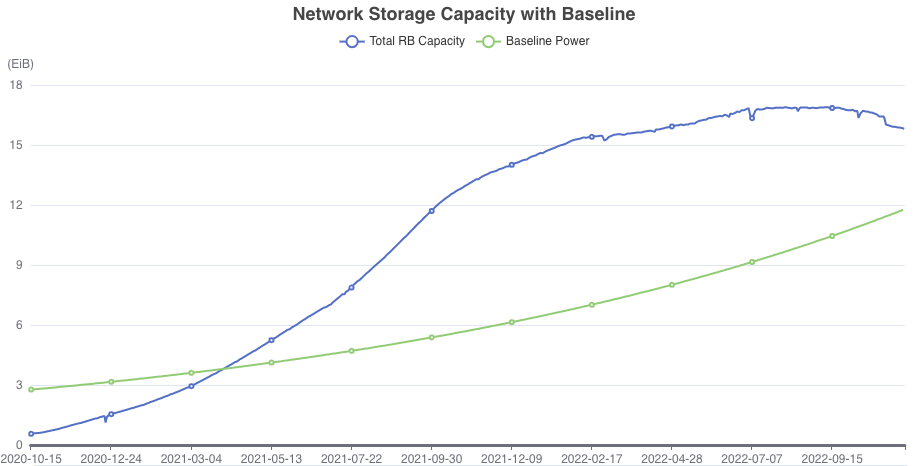

# Post Shark (nv17) Upgrade - Revisiting a Sector Duration Multiplier 

## Summary 
[FIP-0036](https://github.com/filecoin-project/FIPs/blob/master/FIPS/fip-0036.md) proposed cryptoeconomic changes to the Filecoin protocol, and was the subject of lively debate within the Filecoin community beginning.  While this FIP was **rejected** for inclusion in the upcoming nv17 "Shark" network upgrade, many believe its overarching goals were directionally positive for the network. There have been renewed calls to revisit and arrive at consensus for a solution to the problem-space FIP-0036 sought to address, especially amidst an uncertain economic environment both within and external to the Filecoin Network. 

This discussion revisits the problem motivation, and provides a suggested path forward following FIP-0036's resolution, maintaining that the stability and long-term health of the Filecoin network continue to be of paramount importance. 

## Problem Motivatioin
Since FIP-0036's rejection in September 2022, the macroeconomic environment, as well as the health of the Filecoin network have continued to worsen.

FIP-0036 was introduced in July 2022 amidst an uncertain and bearish outlook both within the blockchain space and in the broader global economy. One of the intended goals of the FIP was to introduce economic incentives to provide the network with tools to weather macroeconomic uncertainty, through introducing rewards for Storage Provider's long-term commitment to the network. Since the FIP's introduction, the global macroeconomic environment has only worsened, and cryptocurrency has faced a myriad of compounding additional headwinds. Volatility continues within web3, and the duration of this industry downturn is unclear. Following, FIP-0036's rejection in September 2022, the crypto industry, and by extension the Filecoin economy has been weathering unexpected shocks and industry-defining black swan events. 

Within the Filecoin Network, the amount of hardware backing the network continues to shrink. Expirations and terminations have follow on effects for the stability of storage markets, as pledged collateral is unlocked and enters the network's circulating supply.

**Since July 2022 when FIP-0036 was initially proposed, the network has lost approximately 1 EiB of storage capacity.** 

This trend continuiing affects and harms both economic and network security and stability. These economic realities underscore the **time-sensitivity** of shipping protocol changes to buttress the network amidst elevated volatility. The global continues to evolve rapidly. Hence, this FIP discussion heavily biases towards reducing scope, complexity, and minor disagreement in favor of implementing a change in the positive direction sooner. 

## Suggested Path Forward 

FIP-0036 introduced d a number of conjunctive adjustments to the protocol, with some changes meeting more community disfavour than others. There is high likelihood that we as a commuity can find consensus on the following parameters as broadly-agreeable, and net positive for the Filecoin network and it's relevant stakeholder groups. 

1. **No Change** to the Target Lock Percentage
a. 

